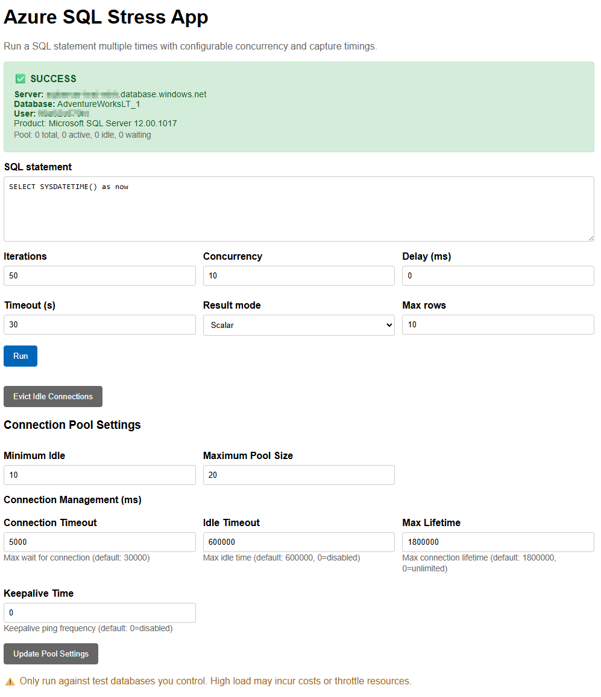
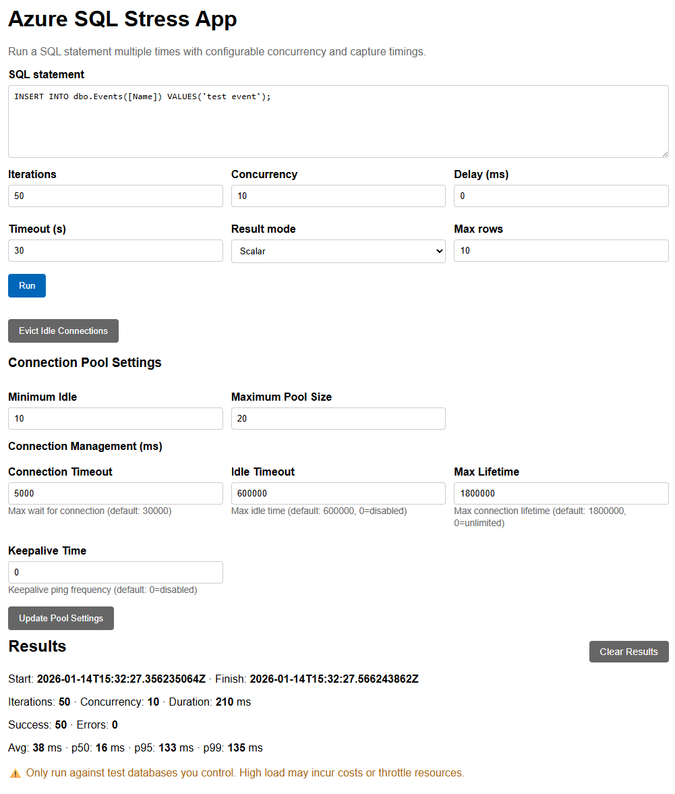

<div align="center">

# Azure SQL Stress App

[](https://openjdk.org/)
[](https://spring.io/projects/spring-boot)
[](https://azure.microsoft.com/products/azure-sql/database/)
[](LICENSE)

A lightweight, web-based stress testing tool for Azure SQL databases built with Spring Boot.

[Features](#features) • [Getting Started](#getting-started) • [Configuration](#configuration) • [Troubleshooting](#troubleshooting) • [License](#license)

</div>

---

## Overview

Azure SQL Stress App enables you to **stress test Azure SQL databases** by repeatedly executing SQL statements with configurable parameters. Easily configure iterations, concurrency levels, timeouts, and result modes through an intuitive web interface—then view aggregated metrics including latency percentiles, success/failure counts, and sample results.

> ⚠️ **Important:** Use responsibly. Only run against **non-production** databases or approved test environments. This tool can generate significant load and may incur costs or trigger throttling.

## Features

| Feature | Description |
|---------|-------------|
| **Flexible SQL Execution** | Execute any SQL statement with configurable iterations and concurrency |
| **Comprehensive Metrics** | View total duration, success/error counts, avg, p50, p95, p99 latency |
| **Result Modes** | Choose from No Rows, Scalar (first value), or Rows (first N rows) |
| **Connection Pooling** | Configurable HikariCP connection pool via environment variables |
| **Multiple Auth Methods** | Supports SQL Authentication and Microsoft Entra ID |
| **Real-time Status** | Live connection status indicator with troubleshooting hints |
| **Cloud-Ready** | Optimized for GitHub Codespaces and Azure Linux VMs |

## Screenshots

<details>
<summary><strong>📸 View Screenshots</strong></summary>

### Application Startup
The web interface on startup with connection status indicator:



### Results View
Test results showing metrics, latency percentiles, and sample data:



</details>

---

## Getting Started

### Prerequisites

- **Java 17** or higher
- **Maven 3.8** or higher
- An **Azure SQL Database** with appropriate access credentials

### Quick Start (GitHub Codespaces)

1. **Fork or clone this repository** to your GitHub account

2. **Open in Codespaces:**
   Navigate to your repository → **Code** → **Codespaces** → **Create codespace on main**

3. **Configure environment variables** using Codespaces Secrets or a local `.env` file:

   | Variable | Description | Example |
   |----------|-------------|---------|
   | `DB_URL` | JDBC connection string | `jdbc:sqlserver://<server>.database.windows.net:1433;database=<db>;encrypt=true;loginTimeout=30;` |
   | `DB_USER` | Username (SQL Auth or Entra ID UPN) | `user@domain.com` |
   | `DB_PASSWORD` | Password | `your-password` |

   > **Microsoft Entra ID Authentication:** Append `authentication=ActiveDirectoryPassword` to the JDBC URL.
   > ⚠️ If a Conditional Access policy enforces MFA, password-based flows will be blocked.

4. **Run the application:**

   ```bash
   mvn spring-boot:run
   ```

5. **Access the UI:** Codespaces will automatically forward port 8080. Open the forwarded URL in your browser.

---

## Deployment Options

### Option 1: Linux VM with Direct Access

<details>
<summary>Click to expand</summary>

1. **SSH into your VM** and clone the repository

2. **Set environment variables:**

   ```bash
   export DB_URL="jdbc:sqlserver://your-server.database.windows.net:1433;database=your-db;encrypt=true;authentication=ActiveDirectoryPassword"
   export DB_USER="username@yourdomain.com"
   export DB_PASSWORD="your-password"
   ```

3. **Run the application:**

   ```bash
   mvn spring-boot:run
   ```

4. **Configure firewall rules:**
   - **Azure NSG:** Add inbound rule for port 8080
   - **Linux UFW:** `sudo ufw allow 8080`

5. **Access the application:** `http://<VM-IP-ADDRESS>:8080`

</details>

### Option 2: Linux VM with SSH Tunnel (Recommended)

<details>
<summary>Click to expand</summary>

This approach provides secure access without exposing ports to the internet.

1. **Create an SSH tunnel** from your local machine:

   ```bash
   ssh -i /path/to/your-key.pem -L 8080:localhost:8080 user@<VM-IP>
   ```

2. **In the SSH session**, start the application:

   ```bash
   mvn spring-boot:run
   ```

3. **Access locally:** Navigate to `http://localhost:8080` in your browser

</details>

---

## Configuration

### Environment Variables

| Variable | Required | Description |
|----------|----------|-------------|
| `DB_URL` | ✅ | JDBC connection string for Azure SQL |
| `DB_USER` | ✅ | Database username |
| `DB_PASSWORD` | ✅ | Database password |

### Connection Pool Settings

HikariCP connection pool can be configured via environment variables. Refer to [application.properties](src/main/resources/application.properties) for available options.

---

## Troubleshooting

### Connection Failed Errors

If you see `total=0, active=0, idle=0` in the connection pool errors, the app cannot establish any database connections.

<details>
<summary><strong>🔧 Common Issues & Solutions</strong></summary>

#### 1. Missing Environment Variables

```bash
# Check if variables are set
echo $DB_URL
echo $DB_USER
# DB_PASSWORD should be set but don't echo it

# Set them if missing
export DB_URL="jdbc:sqlserver://your-server.database.windows.net:1433;database=your-db;encrypt=true;authentication=ActiveDirectoryPassword"
export DB_USER="username@yourdomain.com"
export DB_PASSWORD="your-password"
```

#### 2. Azure SQL Firewall Rules

```bash
# Get your Codespaces IP
curl -s https://api.ipify.org

# Add to Azure SQL firewall via Azure CLI
az sql server firewall-rule create \
  --resource-group YOUR_RG \
  --server YOUR_SERVER \
  --name AllowCodespaces \
  --start-ip-address YOUR_IP \
  --end-ip-address YOUR_IP

# Or enable "Allow Azure Services"
az sql server firewall-rule create \
  --resource-group YOUR_RG \
  --server YOUR_SERVER \
  --name AllowAzureServices \
  --start-ip-address 0.0.0.0 \
  --end-ip-address 0.0.0.0
```

#### 3. Authentication Issues

| Auth Type | Configuration |
|-----------|---------------|
| **SQL Auth** | Use `DB_USER=sqluser` and omit `authentication=` from JDBC URL |
| **Entra ID** | Use `DB_USER=username@domain.com` and add `authentication=ActiveDirectoryPassword` |
| **MFA Required** | Password auth won't work. Use service principal or managed identity instead |

#### 4. Test Connectivity

```bash
# Test TCP connection to Azure SQL Gateway service
nc -zv your-server.database.windows.net 1433

# Or with telnet
telnet your-server.database.windows.net 1433
```

📚 Learn more about [Azure SQL Database connectivity architecture](https://learn.microsoft.com/en-us/azure/azure-sql/database/connectivity-architecture?view=azuresql).

</details>

### Debug Logging

The app includes detailed debug logging. Check the console output for:

- HikariCP pool initialization messages
- JDBC driver connection attempts
- Detailed error messages with SQL State codes

Example log patterns:
```
HikariPool-1 - Starting...
HikariPool-1 - Exception during pool initialization
Login failed for user 'xxx'
```

### Connection Status in UI

The web interface displays real-time connection status:

| Status | Indicator | Description |
|--------|-----------|-------------|
| ✅ Connected | Green box | Successfully connected with server/database details |
| ❌ Failed | Red box | Connection failed with error details and troubleshooting hints |

Use the **🔄 Retry Connection** button to test again after fixing issues.

---

## Contributing

Contributions are welcome! Please feel free to submit a Pull Request.

---

## License

This project is licensed under the MIT License - see the [LICENSE](LICENSE) file for details.
